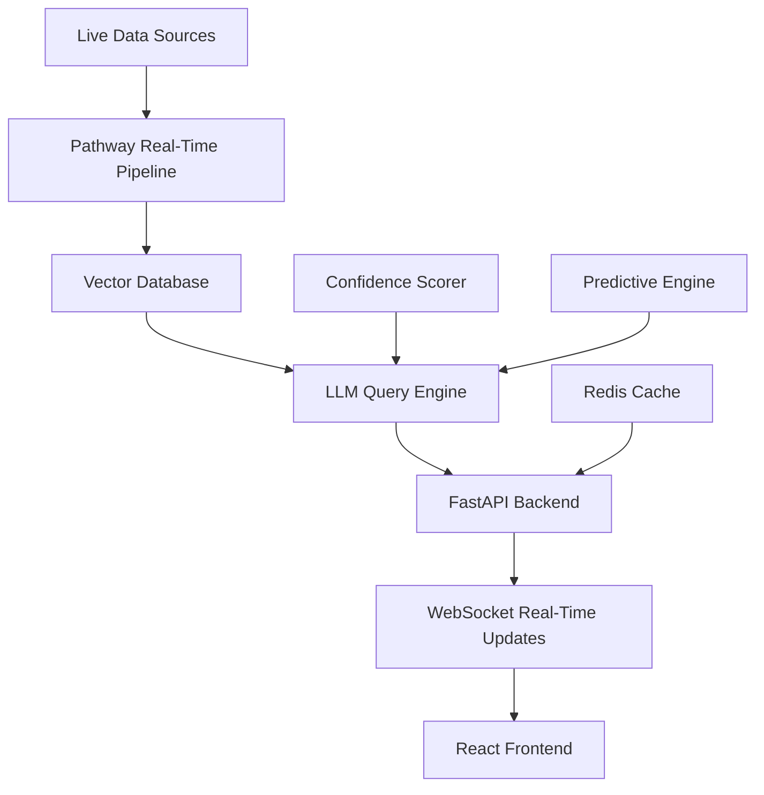

# 🧠 LiveMind - Real-Time Multi-Source Intelligence Platform

[](https://opensource.org/licenses/MIT)
[](https://www.python.org/downloads/)
[](https://pathway.com/)
[](https://fastapi.tiangolo.com/)

> **Live Intelligence That Never Stops Learning** - A revolutionary AI platform that ingests, processes, and analyzes real-time data from multiple sources to provide intelligent, context-aware responses with predictive insights.

## 🌟 **What Makes LiveMind Special?**

LiveMind isn't just another chatbot - it's a **living digital brain** that:

- 🔄 **Learns in real-time** from multiple live data sources
- 🧠 **Thinks contextually** across different domains simultaneously  
- 🔮 **Predicts insights** before you even ask
- 📊 **Scores source confidence** to combat misinformation
- 🕰️ **Time travels** through data to show evolution of topics
- 👥 **Collaborates intelligently** across teams

## 🎯 **Core Features**

### 🚀 **Real-Time Multi-Source Ingestion**
- **Live News Feeds** (RSS, Reddit, Twitter)
- **Financial Data** (Stock prices, market sentiment)
- **Weather APIs** (Context-aware environmental data)
- **Document Monitoring** (PDFs, docs that auto-update)
- **Social Media** (Real-time sentiment analysis)
- **Team Communications** (Slack, email integration)

### 🧠 **Intelligent Context Engine**
- **Smart Query Routing** - Knows which sources to consult
- **Multi-Modal Fusion** - Combines text, numbers, and trends
- **Confidence Scoring** - Rates information reliability
- **Predictive Analytics** - Anticipates information needs
- **Temporal Analysis** - Tracks how opinions evolve over time

### ⚡ **Real-Time Capabilities**
- **Sub-second responses** for complex multi-source queries
- **Live updates** as new information becomes available
- **Streaming insights** that update during conversations
- **Proactive alerts** for important changes
- **Collaborative intelligence** for team knowledge sharing

## 🏗️ **Technical Architecture**



### 🛠️ **Tech Stack**

**Backend (Real-Time Processing)**
- **Pathway** - Real-time data processing framework
- **FastAPI** - High-performance async API
- **Pinecone/Chroma** - Vector database for semantic search
- **OpenAI/Anthropic** - LLM integration
- **Redis** - Caching and session management
- **WebSockets** - Real-time client updates

**Frontend (User Interface)**
- **Next.js + React** - Modern web framework
- **TypeScript** - Type-safe development
- **Tailwind CSS** - Utility-first styling
- **Chart.js/Recharts** - Data visualization
- **Socket.io** - Real-time communication

**Infrastructure**
- **Docker** - Containerized deployment
- **AWS/GCP** - Cloud hosting
- **GitHub Actions** - CI/CD pipeline
- **Monitoring** - Performance and error tracking

## 🚀 **Quick Start**

### Prerequisites
- Python 3.9+
- Node.js 18+
- Docker (optional)
- API keys for data sources

### 1. Clone the Repository
```bash
git clone https://github.com/yourusername/LiveMind.git
cd LiveMind
```

### 2. Backend Setup
```bash
cd backend
python -m venv venv
source venv/bin/activate  # On Windows: venv\Scripts\activate
pip install -r requirements.txt
cp .env.example .env  # Add your API keys
python -m uvicorn main:app --reload
```

### 3. Frontend Setup
```bash
cd frontend
npm install
npm run dev
```

### 4. Access LiveMind
- **Backend API**: http://localhost:8000
- **Frontend**: http://localhost:3000
- **API Docs**: http://localhost:8000/docs

## 📊 **Demo Scenarios**

### 🏢 **Business Intelligence**
```
Query: "What's happening with Tesla stock and why?"
Response: Real-time stock price + latest news + social sentiment + analyst reports
```

### 🌍 **Research Assistant**
```
Query: "Should I invest in renewable energy right now?"
Response: Market trends + policy changes + expert opinions + weather patterns
```

### 📈 **Predictive Insights**
```
Query: "What might affect my portfolio today?"
Response: Proactive analysis of upcoming events, earnings, and market indicators
```

### 👥 **Team Collaboration**
```
Feature: Shared team knowledge base that updates as team members research topics
Alert: "Your teammate just found important info about the competitor launch"
```

## 🎯 **Project Roadmap**

### ✅ **Phase 1: Foundation (Days 1-3)**
- [x] Project setup and basic structure
- [x] Pathway pipeline foundation
- [x] FastAPI backend with WebSocket
- [x] Basic query processing
- [x] Simple frontend interface

### 🔄 **Phase 2: Core Features (Days 4-6)**
- [ ] Multi-source data integration
- [ ] Advanced query processing
- [ ] Real-time updates and alerts
- [ ] Source confidence scoring
- [ ] Data visualization components

### ⭐ **Phase 3: Polish & Demo (Days 7-8)**
- [ ] Performance optimization
- [ ] Demo scenarios and data
- [ ] UI polish and animations
- [ ] Deployment and monitoring
- [ ] Documentation and presentation

## 🏆 **Why LiveMind Will Win**

✅ **Cutting-Edge Technology** - Real-time RAG with multi-source intelligence
✅ **Practical Value** - Solves real problems for researchers, analysts, and teams
✅ **Visual Impact** - Beautiful UI with live data updates
✅ **Scalable Architecture** - Can expand to any domain or use case
✅ **Demo-Ready** - Easy to show compelling live scenarios
✅ **Business Potential** - Clear path to commercialization

## 🤝 **Team**

- **Backend Developer** - Real-time pipeline, LLM integration, APIs
- **Frontend Developer** - Modern UI, visualizations, user experience

## 📝 **License**

This project is licensed under the MIT License - see the [LICENSE](LICENSE) file for details.

## 🙏 **Acknowledgments**

- **Pathway** for the incredible real-time processing framework
- **Code Cubicle 4.0** for inspiring innovative AI solutions
- The open-source community for amazing tools and libraries

---

<div align="center">

**🧠 LiveMind - Where Intelligence Meets Real-Time** 

*Built with ❤️ for Code Cubicle 4.0*

[Live Demo](https://livemind-demo.vercel.app) • [Documentation](./docs) • [API Reference](https://livemind-api.herokuapp.com/docs)

</div>
